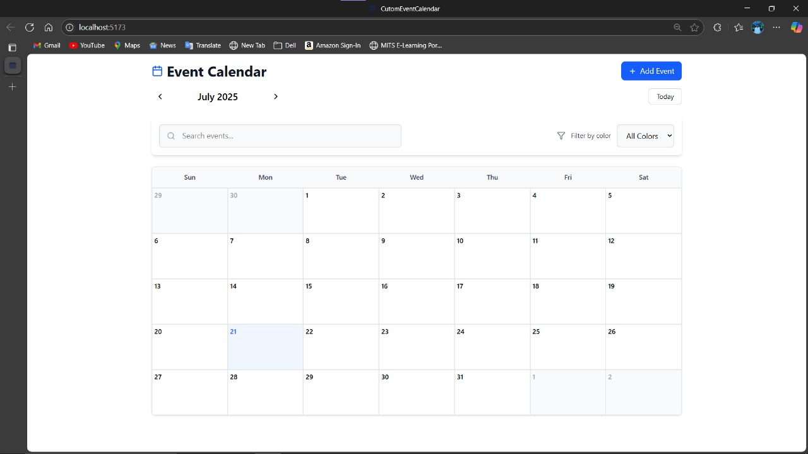

# 📅 Event Calendar Application

<!-- Replace with your actual screenshot -->

A sleek and fully-featured event calendar built with React, designed for seamless event management and scheduling

##  Features

### 📅 Core Calendar
- Monthly grid view with easy-to-use navigation controls
- "Today" button for instant return to the current date
- Fully responsive design, optimized for desktops, tablets, and mobiles

### 🎯 Event Management
- Create and manage events with title, date/time, and description
- Choose from 6 distinct color options for visual organization
- Support for recurring events with flexible patterns: daily, weekly, monthly, and custom intervals
- Drag-and-drop functionality for effortless event rescheduling
- Edit or delete events with a user-friendly interface

### 🔍 Search & Filter
- Powerful full-text search over event titles and descriptions
- Filter events based on their assigned colors
- Conflict detection to highlight overlapping or clashing events

### ⚙️ Technical Features
- Persistent event storage using localStorage for offline continuity
- Robust date utilities for accurate event handling
- Designed with keyboard accessibility for inclusive usage
- Modular and maintainable component-based architecture

## 🛠️ Installation

1. **Clone the repository**:
```bash
git clone https://github.com/Gunavardhansai/CustomEventCalendar.git
cd CustomEventCalendar
npm install
npm run dev
Open your browser at http://localhost:3000 (or the port specified) to start using the calendar.
